# DCF Valuation Model - Excel Generator

A Python tool that generates a professional **Discounted Cash Flow (DCF) valuation model** as a formatted Excel workbook for any publicly traded stock — complete with **35 charts** across **12 sheets**.

## Features

- **Live Data**: Pulls real-time stock prices, financial statements, and balance sheet data from Yahoo Finance (free, no API key required)
- **Interest Rates**: Fetches current Treasury yields from Yahoo Finance (or FRED API with optional key)
- **Any Stock**: Just change the ticker symbol — works for any publicly traded company
- **5 Scenario Paths**: Models different interest rate and growth trajectories
- **12 Excel Sheets**: Comprehensive, professionally formatted workbook
- **35 Charts**: Bar charts, line charts, pie charts, and sensitivity curves
- **Sensitivity Analysis**: WACC vs Terminal Growth and Revenue Growth vs Margin sensitivity tables with color-coded heatmaps

## Quick Start

```bash
# Install dependencies
pip install -r requirements.txt

# Generate DCF model for Apple
python generate_dcf.py AAPL

# Generate for Microsoft with custom output file
python generate_dcf.py MSFT -o microsoft_valuation.xlsx

# Generate for Tesla with 7-year projections
python generate_dcf.py TSLA --projection-years 7

# Use FRED API for interest rates (optional, free key)
python generate_dcf.py GOOGL --fred-key YOUR_API_KEY
```

---

## Sheet Previews

### Sheet 1: Dashboard

The main overview page — company info, market data, interest rates, scenario summary, and 4 charts showing Revenue & FCF trends, Scenario Valuation Comparison, Profitability Margins, and WACC components.

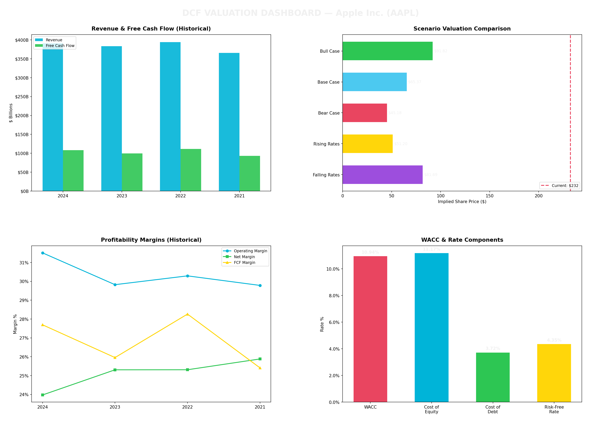

---

### Sheet 2: Income Statement

Historical Revenue, Operating Income, and Net Income with margin trend analysis.

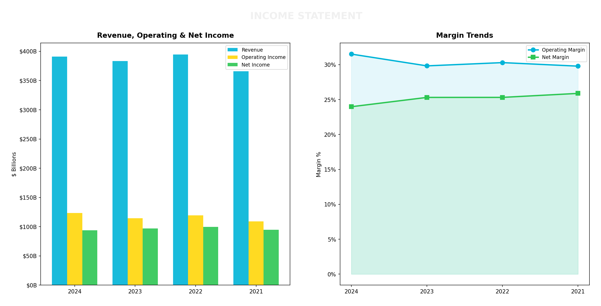

---

### Sheet 3: Balance Sheet

Assets vs Liabilities breakdown, Debt/Equity ratio tracking, and Cash vs Debt comparison.

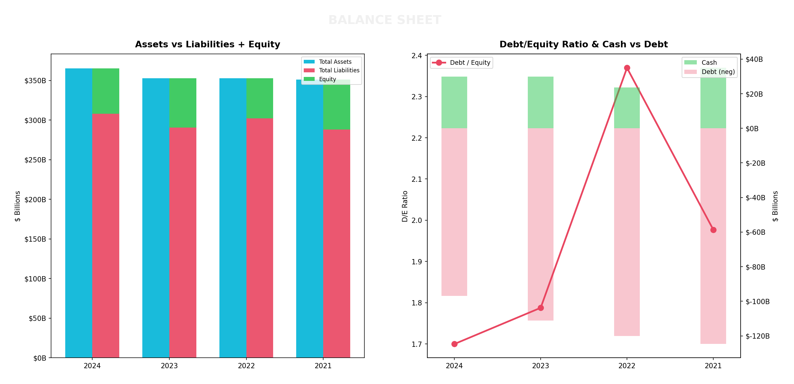

---

### Sheet 4: Cash Flow Statement

Operating Cash Flow, Free Cash Flow, and CapEx with FCF Yield and CapEx Intensity trends.

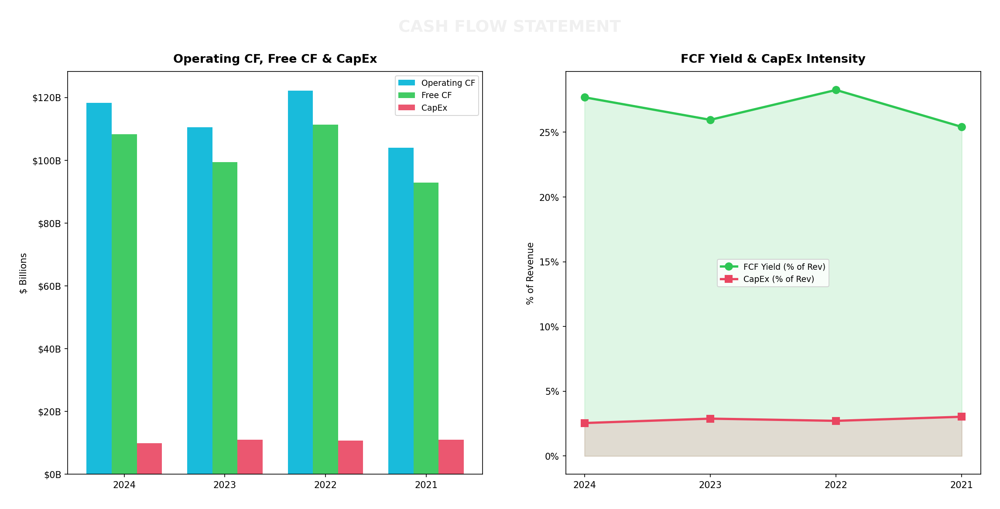

---

### Sheet 5: WACC (Weighted Average Cost of Capital)

Capital structure pie chart, WACC component rates, and CAPM breakdown showing how Cost of Equity is derived from Risk-Free Rate + Beta x ERP.

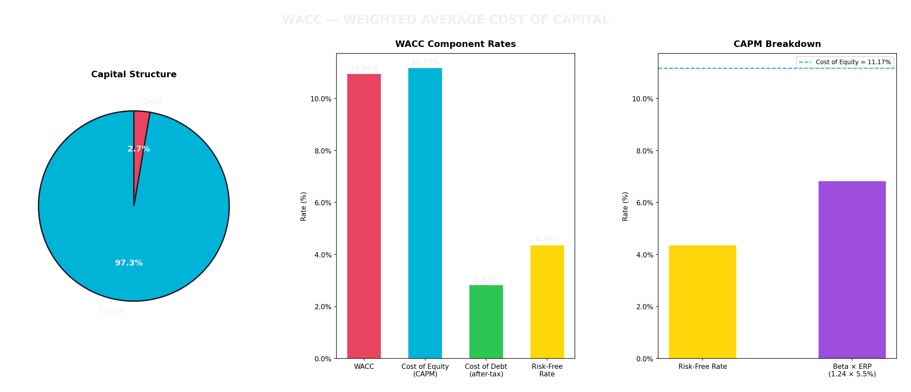

---

### Sheets 6-10: DCF Scenario Models

Each of the 5 scenarios gets a dedicated sheet with Revenue Projections, FCF vs Present Value comparison, a Valuation Bridge, and Key Metrics summary.

**Sheet 6 — Base Case:** Moderate growth, current interest rates maintained

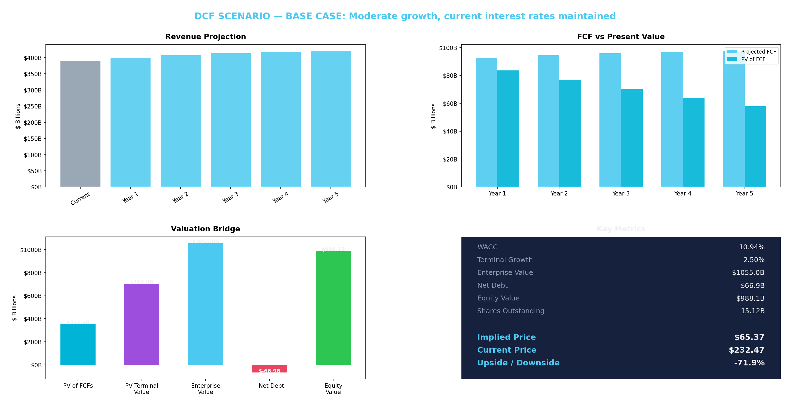

**Sheet 7 — Bull Case:** Rising sales & profit, falling interest rates (-100bp)


**Sheet 8 — Bear Case:** Falling sales & profit, rising interest rates (+150bp)

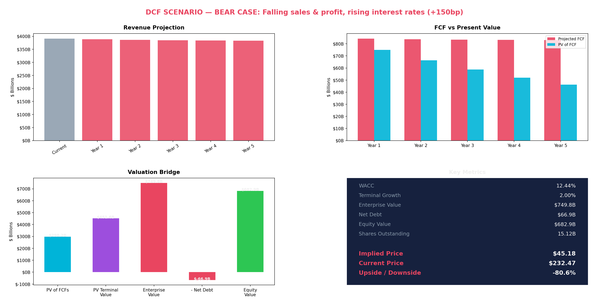

**Sheet 9 — Rising Rates:** Stable sales, aggressive rate hikes (+200bp)

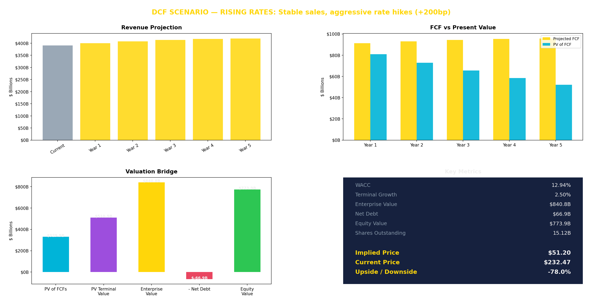

**Sheet 10 — Falling Rates:** Stable sales, rate cuts (-150bp)

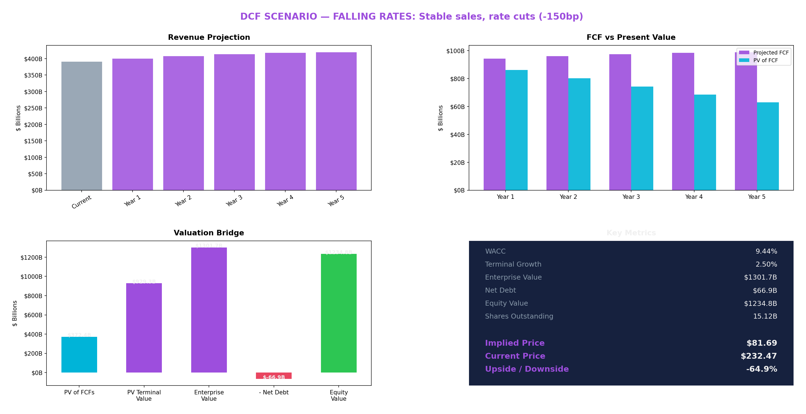

---

### Sheet 11: Scenario Comparison

Side-by-side comparison of all 5 scenarios — implied prices, enterprise value breakdown, WACC vs Terminal Growth, projected FCF and Revenue across all paths.

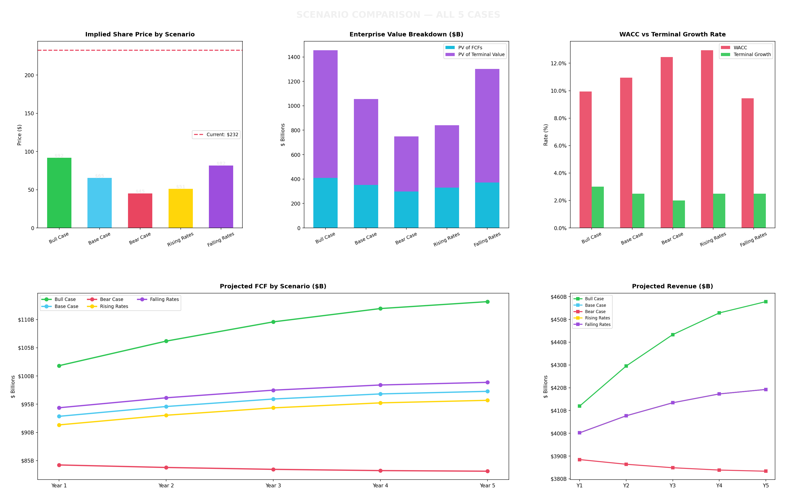

---

### Sheet 12: Sensitivity Analysis

How changes in WACC and Terminal Growth Rate affect the implied share price — with the current price shown as reference.

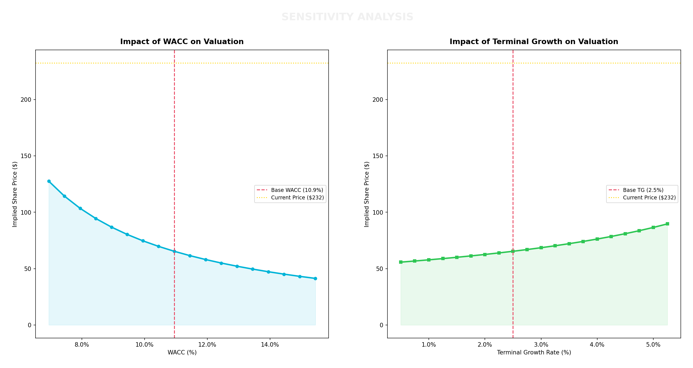

---

## Chart Highlights

### Interest Rate Impact on Valuation

Shows how different interest rate environments change the WACC and resulting implied share price — lower rates = higher valuations.

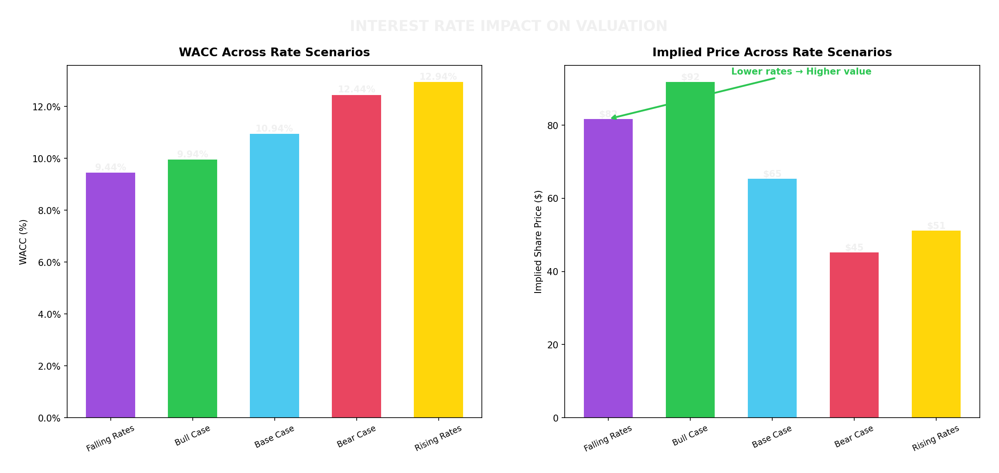

### Valuation Range Across All Scenarios

Where does the current market price sit relative to DCF-implied values across all 5 scenarios?

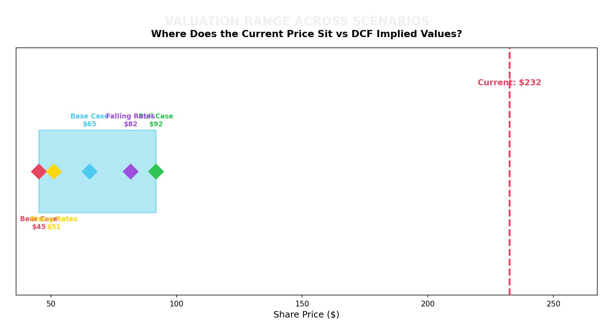

### Revenue Waterfall: Historical to Projected

Historical revenue flowing into projected revenue under Bull, Base, and Bear scenarios.

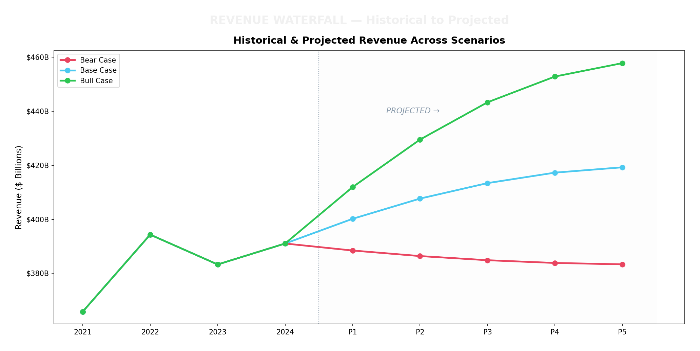

---

## Complete Chart Inventory (35 Charts)

| Sheet | Charts | Chart Types |
|-------|--------|-------------|
| Dashboard | 4 | Revenue/FCF/NI bar, Margins line, Scenario prices bar, WACC/TG bar |
| Income Statement | 2 | Revenue waterfall bar, Profit margins line |
| Balance Sheet | 2 | Structure bar, D/E & Current ratio line |
| Cash Flow | 2 | OCF vs FCF bar, FCF yield & CapEx line |
| WACC | 3 | Capital structure pie, Component rates bar, Rate environment bar |
| DCF Base Case | 3 | Revenue projection bar, FCF vs PV bar, Valuation bridge bar |
| DCF Bull Case | 3 | Revenue projection bar, FCF vs PV bar, Valuation bridge bar |
| DCF Bear Case | 3 | Revenue projection bar, FCF vs PV bar, Valuation bridge bar |
| DCF Rising Rates | 3 | Revenue projection bar, FCF vs PV bar, Valuation bridge bar |
| DCF Falling Rates | 3 | Revenue projection bar, FCF vs PV bar, Valuation bridge bar |
| Scenario Comparison | 5 | Price comparison bar, EV stacked bar, WACC/TG bar, FCF line, Revenue line |
| Sensitivity Analysis | 2 | WACC impact line, Terminal growth impact line |
| **Total** | **35** | |

---

## Scenarios Modeled

| Scenario | Revenue Growth | Margin | WACC | Description |
|----------|---------------|--------|------|-------------|
| **Bull Case** | +3% | +2% | -100bp | Rising sales & profit, falling rates |
| **Base Case** | Historical avg | Historical avg | Current | Moderate growth, current rates |
| **Bear Case** | -3% | -2% | +150bp | Falling sales & profit, rising rates |
| **Rising Rates** | Stable | -0.5% | +200bp | Aggressive rate hikes |
| **Falling Rates** | Stable | +0.5% | -150bp | Rate cuts |

## Data Sources (All Free)

| Data | Source | API Key Required? |
|------|--------|-------------------|
| Stock price, market cap | Yahoo Finance (yfinance) | No |
| Income statement | Yahoo Finance | No |
| Balance sheet | Yahoo Finance | No |
| Cash flow statement | Yahoo Finance | No |
| 10-Year Treasury yield | Yahoo Finance ^TNX | No |
| Federal Funds Rate | FRED API (optional) | Free key at [fred.stlouisfed.org](https://fred.stlouisfed.org/docs/api/api_key.html) |

## How the DCF Model Works

```
                          HISTORICAL DATA                    PROJECTIONS
                     +----------------------+          +----------------------+
                     |  Revenue             |          |  Revenue (grown by   |
  Yahoo Finance ---->|  Operating Income    |---->-----|  historical avg +    |
  (Free API)         |  Net Income          |          |  scenario adj.)      |
                     |  Free Cash Flow      |          |                      |
                     |  Balance Sheet       |          |  EBIT = Rev x Margin |
                     |  Debt / Cash         |          |  NOPAT = EBIT(1-T)   |
                     +----------------------+          |  FCF = NOPAT+D&A-CapEx|
                                                       +----------+-----------+
                                                                  |
  +--------------------------------------------------------------- |
  |                                                                |
  |  WACC CALCULATION                                              v
  |  +----------------------+                      +----------------------+
  |  |  Cost of Equity (Re) |                      |  DISCOUNT FCFs       |
  |  |  = Rf + Beta x ERP   |                      |                      |
  |  |                      |                      |  PV = FCF/(1+WACC)^t |
  |  |  Cost of Debt (Rd)   |-------->-------------|                      |
  |  |  = Int.Exp / Debt    |         WACC         |  Terminal Value =    |
  |  |                      |                      |  FCF*(1+g)/(WACC-g)  |
  |  |  WACC = (E/V)Re +   |                      |                      |
  |  |    (D/V)Rd(1-T)     |                      |  Enterprise Value =  |
  |  +----------------------+                      |  Sum(PV) + PV(TV)   |
  |                                                +----------+-----------+
  |                                                           |
  |  Yahoo Finance ^TNX --> Risk-Free Rate                    v
  |  (or FRED API)                                 +----------------------+
  |                                                |  EQUITY VALUE        |
  |  5 SCENARIOS apply adjustments:                |  = EV - Net Debt     |
  |  +-------------------------+                   |                      |
  |  | Bull:  Growth+3%, WACC-1%|                  |  IMPLIED PRICE       |
  |  | Base:  No adjustments    |------>-----------|  = Equity / Shares   |
  |  | Bear:  Growth-3%, WACC+1.5%|               |                      |
  |  | Rates+: WACC+2%         |                   |  UPSIDE/DOWNSIDE     |
  |  | Rates-: WACC-1.5%      |                   |  vs Current Price    |
  |  +-------------------------+                   +----------------------+
  +------------------------------------------------------------------------
```

## CLI Options

```
usage: generate_dcf.py [-h] [-o OUTPUT] [--fred-key FRED_KEY]
                       [--projection-years N] [--terminal-growth RATE]
                       [--erp RATE] [--sample] ticker

Arguments:
  ticker                Stock ticker symbol (e.g., AAPL, MSFT, TSLA)
  -o, --output          Output Excel file path (default: <TICKER>_DCF_Model.xlsx)
  --fred-key            FRED API key for interest rate data
  --projection-years    Number of projection years (default: 5)
  --terminal-growth     Terminal growth rate (default: 0.025 = 2.5%)
  --erp                 Equity Risk Premium (default: 0.055 = 5.5%)
  --sample              Force use of sample data (no API calls)
```

## Project Structure

```
DCF_Excel-Sheet/
├── generate_dcf.py          # Main entry point - run this
├── data_fetcher.py          # Yahoo Finance + FRED API data retrieval
├── dcf_engine.py            # DCF calculations, WACC, scenarios
├── excel_builder.py         # Excel workbook generation (35 charts, 12 sheets)
├── generate_screenshots.py  # Generates README preview images
├── requirements.txt         # Python dependencies
├── docs/
│   └── screenshots/         # Sheet preview images (15 PNGs)
└── README.md
```
